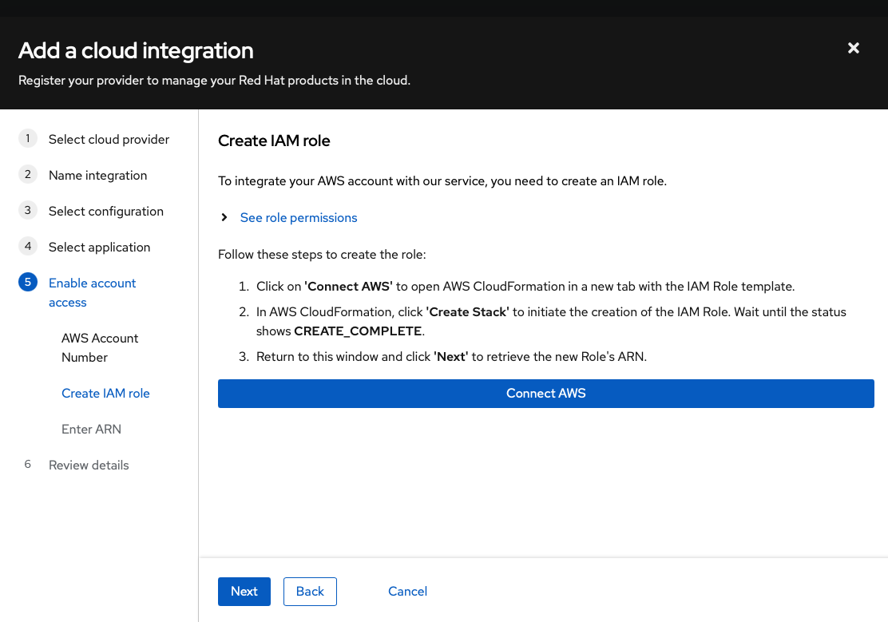
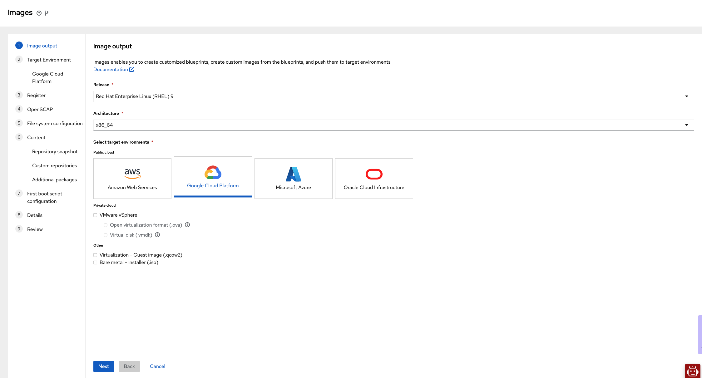
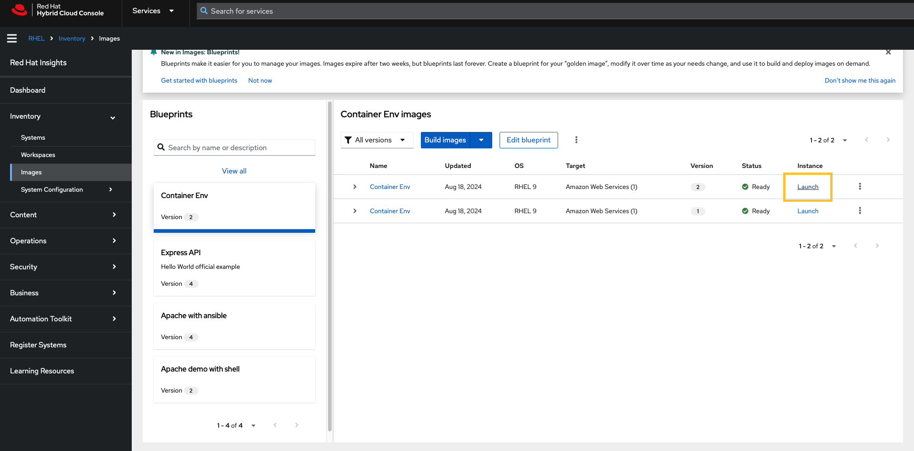
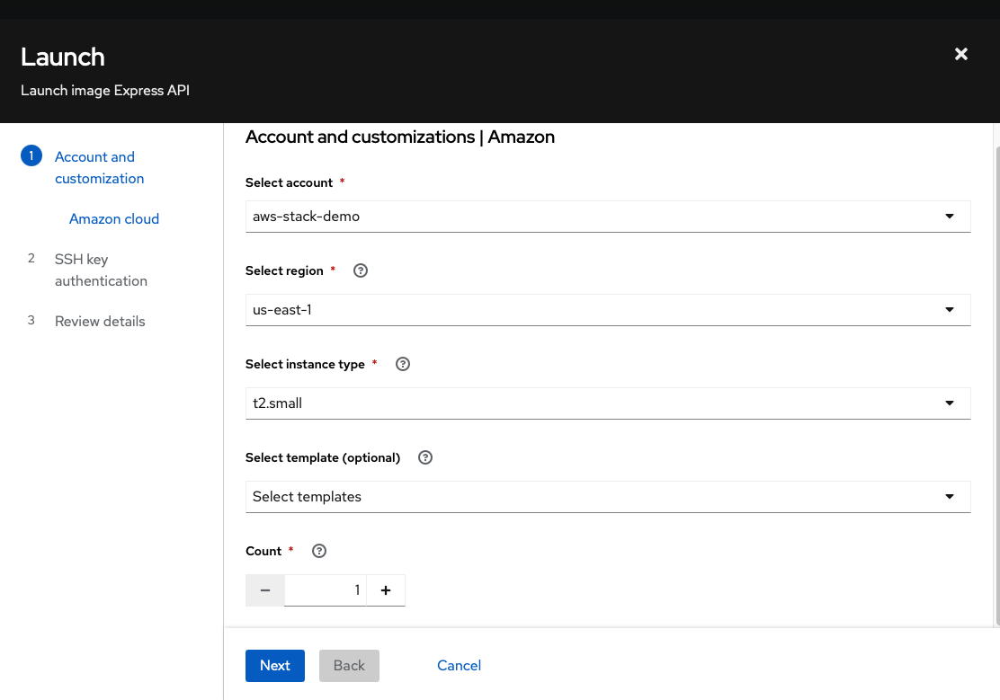
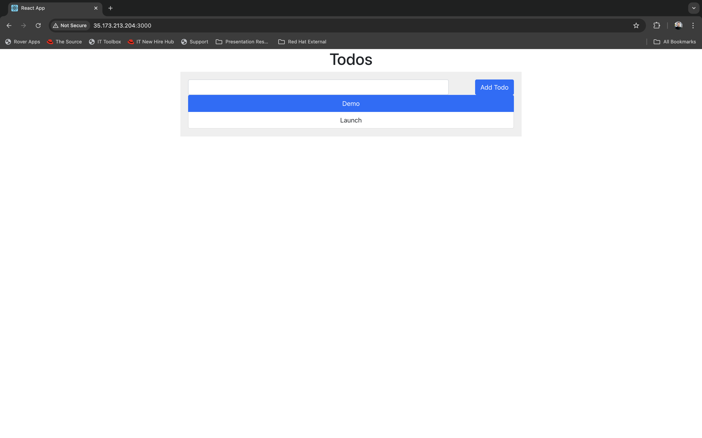

# From Code to Cloud
### Craft & Deploy Custom RHEL Images for the Cloud with Red Hat’s No-Cost Dev Subscription

For developers having access to powerful easy to use tools and platforms is crucial for building, testing, and deploying applications. Red Hat offers a no-cost developer subscription that allows individual developers to use up to 16 systems for demos, prototyping, QA, small production uses, and cloud access. In this blog post, we will explore using this subscription to leverage some of the new features of Red Hat cloud services that are particularly suited for developers.

In the competitive environment of startup development, achieving efficiency and security while maintaining cost is essential, especially when venturing into the public cloud. The Red Hat Developer Subscription stands out as a powerful ally in this journey at no cost. This subscription enables developers to craft custom RHEL production-like images with specific content and packages, applying Security Content Automation Protocol (SCAP) policies, and utilizing first-boot scripts. This article delves into how developers and early stage startups can utilize this invaluable resource to deploy these custom images to the public cloud, ensuring optimized and secure systems while keeping costs in check.

Let's explore practical examples of creating custom RHEL images and deploying them in the cloud with minimal effort. In this post, we demonstrate how to deploy a complete containerized environment using the [Compose specification](https://www.compose-spec.io), but you can find more examples under the [examples](examples) folder, these deployments are just examples of the many types of deployments you can achieve using Red Hat Hybrid Cloud.

## Deploy Your Containerized Environments
Containerized environments using Docker or Podman have become standard practice during development. Developers frequently seek efficient and secure ways to deploy these environments to the public cloud for demos, MVPs, testing, or prototyping. While solutions like Kubernetes or Red Hat OpenShift are excellent for production at scale, they can be too heavy for smaller, development-focused tasks. In this post, we’ll walk through a more lightweight approach by deploying a containerized application from the [awesome-compose](https://github.com/docker/awesome-compose) repository, a todo app based on MERN (MongoDB, Express, React, and Node) popular stack . While we’ll focus on Amazon Web Services, you can easily adapt these instructions to another cloud provider and to your containerized application.

## Why Choose Red Hat Linux
[Red Hat Hybrid Cloud](https://console.redhat.com) offers a robust ecosystem for monitoring and managing your deployment’s security and stability posture, serves as a central platform for managing your systems, enables optimization of your RHEL deployments in the cloud. This comprehensive toolset includes:

* **RHEL Security Features:** Monitoring and managing your deployments' security posture, with real-time alerts and vulnerability management.
* **Insights Advisor:** Offering tailored recommendations for enhancing system performance and security. By analyzing specific configurations and usage patterns, it suggests improvements based on a vast repository of best practices.
* **Ansible Playbooks Automation:** Facilitating the application of fixes, addressing Common Vulnerabilities and Exposures (CVEs), and ensuring SCAP compliance. 
  Automating these tasks through Ansible playbooks significantly reduces manual efforts, allowing teams to concentrate on development and innovation.

These integrated features support a proactive approach to security, providing automated tools and comprehensive insights to help maintain security standards and compliance across your cloud deployments.


## Registering for the No-Cost Developer Subscription
To get started, follow these steps to register for the Red Hat Developer Subscription:

1. Visit the [Red Hat Developer Subscription page](https://developers.redhat.com/register).
2. Sign up for a Red Hat account if you don't already have one.
3. Log in and navigate to the subscription management page.
4. Activate your no-cost developer subscription.
5. Verify your new user and try to log in to [Red Hat Console](https://console.redhat.com) 

## Using Red Hat Hybrid Cloud

### 1. Public cloud integration setup (AWS)

To deploy your new system to the public cloud, let's create a cloud integration. In this tutorial, we'll use AWS, but you can choose another cloud provider such as GCP or Azure. This step is optional; you may also create blueprints and build custom images as ISO installers and QCOW2 for virtual machines.



1. Visit the [Red Hat Integrations page](https://console.redhat.com/settings/integrations).
2. Navigate to the Cloud tab and click on Add Integration.
3. Choose your cloud provider (in this example, AWS).
4. Assign a name to this integration profile; we'll use this profile name in the following steps.
5. Select the Launch Images application.
6. Enter your AWS account number.
7. Click Connect AWS. This will open a new window and redirect you to the AWS CloudFormation stack    creation page. Click on Create Stack to generate the required policy and role for this integration.
8. Return to the Red Hat wizard page, click Next, verify the created role's ARN and add the new integration.

Your new cloud integration is now ready.

### 2. Create and Customize a Red Hat Linux Image via Blueprints

Red Hat cloud services allow you to create and customize Red Hat Enterprise Linux (RHEL) images using blueprints. Create a blueprint for your **golden image**, modify it over time as your needs change, and use it to build and deploy images on demand. Here's how to do it.



 **Open the blueprint wizard**

 - Log in to the Red Hat Hybrid Cloud Console.
 - Navigate to the [Image Builder](https://console.redhat.com/preview/insights/image-builder) service and create a new blueprint.
 - Click on **Create blueprint** button
 - Choose your desired RHEL version, architecture, and target environments. For this post, we use RHEL 9, x86_64 and Google Cloud Platform accordingly.

 **Target environment -> AWS**

 - Choose **Share image with a Google account**
 - Add your corresponding AWS integration source from the previous step 

 **Register**

Your no-cost subscription allows up to 16 systems
- Keep checked the `Automatically register and enable advanced capabilities` option
- Open the Activation key dropdown an pick one, if you haven't created any, pick the default one.

 **OpenSCAP**

 - This step allows you to add an openSCAP profile for your image, for this demo we can skip this step. Click **next**.

**File system configuration**

 - This step configures the partitioning of the image.
 - Keep the recommended automatic partitioning for this demo.

**Content**
 This step allows you to customize the repositories and packages.
 Go to **Additional packages** and add these packages:

- git
- podman
- podman-compose
- aardvark-dns (used in podman for DNS)
- python3-pip

**First boot**

This step configures the image with a custom script that executes on its first boot. The script can be shell, python, yml, etc. For this demo, copy the following playbook
This playbook clone the containerized application and build its containers using podman compose.
```yaml
#!/usr/bin/env ansible-playbook
---
- name: Deploy Web Application with Podman on RHEL using RHEL System Roles
  hosts: localhost
  become: yes  # Adjust based on rootful or rootless Podman

  vars:
    repo_url: "https://github.com/amirfefer/awesome-compose.git"
    subdir_path: "react-express-mongodb"
    app_dir: "/opt/demo-app"
    podman_network_name: "demo_network"
    public_interface: "eth0"
    log_file: "/var/log/podman_compose.log"  # Log file for capturing compose output

  tasks:
    - name: Install required packages
      yum:
        name:
          - git
          - podman
          - python3-pip
        state: present

    - name: Clone the GitHub repository
      git:
        repo: "{{ repo_url }}"
        dest: "{{ app_dir }}"
        version: "master"

    - name: Ensure the subdirectory exists
      stat:
        path: "{{ app_dir }}/{{ subdir_path }}"
      register: subdir_exists

    - name: Fail if subdirectory does not exist
      fail:
        msg: "The specified subdirectory {{ subdir_path }} does not exist in the repository."
      when: not subdir_exists.stat.exists

    - name: Check if Podman network exists
      command: podman network inspect {{ podman_network_name }}
      register: podman_network_exists
      ignore_errors: true

    - name: Create Podman network if it does not exist
      command: podman network create {{ podman_network_name }}
      when: podman_network_exists.rc != 0

    - name: Run Podman Compose to start containers
      command: podman-compose -f {{ app_dir }}/{{ subdir_path }}/compose.yaml up -d
      args:
        chdir: "{{ app_dir }}/{{ subdir_path }}"

    - name: Display status of Podman containers
      command: podman ps
      register: podman_status

    - name: Show the Podman container status
      debug:
        msg: "{{ podman_status.stdout }}"
    - name: Save Podman Compose output to log file
      copy:
        content: "{{ compose_output.stdout }}"
        dest: "{{ log_file }}"
      when: compose_output.stdout is defined
```

 **Save and build the blueprint:**
 After giving a name and description to our new blueprint, double-check the review section and save your blueprint. Open the save button dropdown and click **Save changes and build image** this creates the blueprint and also builds the image. Red Hat makes it easy to manage your blueprints for future use:

 **Export and Import Blueprints**

 Export blueprints for sharing with your team or importing into other projects. This feature is particularly useful for maintaining consistency across multiple workloads. 


### 3. Deploying to the public cloud

The build process takes a few minutes, once the image has been built successfully, the **Launch** button appears, click it to open the launch wizard, just make sure that you configured the AWS integration source before.





 **Compute configuration**

 - Select your AWS integration.
 - Select an instance type, you can filter by vcpus, memory, and capacity, i.e, type `vcpus=2 and memory<2500` and pick **t3.small** for this demo.

**SSH key**
Keep in mind some cloud providers no longer support RSA SSH key types. 
 - You can create a new key by running ```ssh-keygen -t ed25519``` on your terminal.

**Launch**
 - Review and launch
 - This process might take a minute, Once the deployment is complete, you’ll be provided with instance details, including the SSH command for connecting to your server.

### 4. Expose HTTP connection

To allow HTTP connections or any other inbound traffic, log in to your AWS console and add the desired rule in the created VM's associated VPC security group, it can be the [default security group](https://console.aws.amazon.com/vpc/home?#SecurityGroups:search=default).


That’s it! Open your browser, enter the public IP or DNS of your instance, and your application should be up and running.

