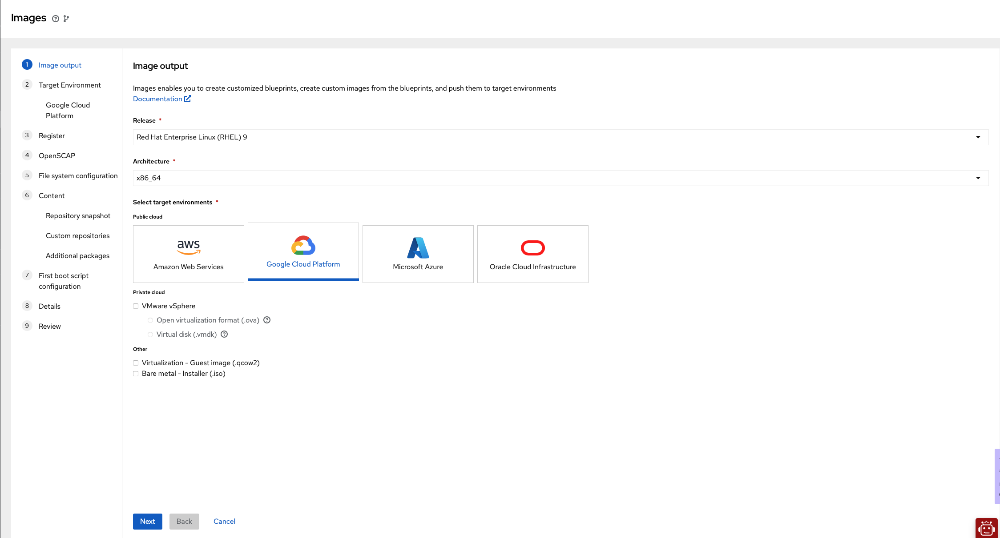
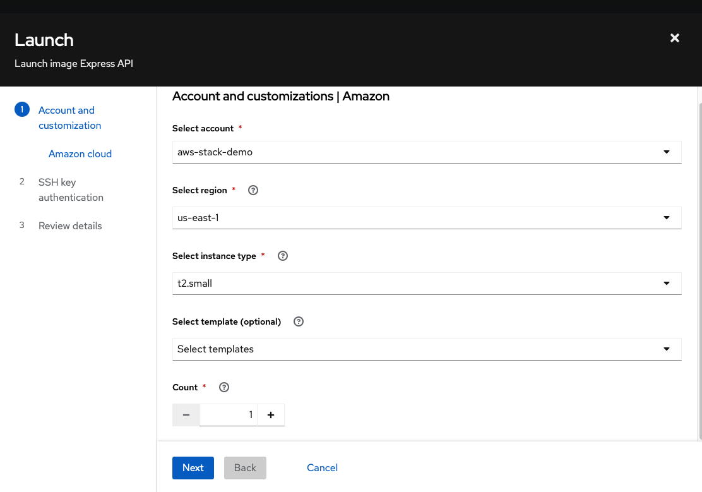
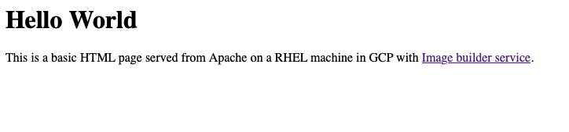

# Maximize Your Development Potential: Free Red Hat Developer Subscription for Custom RHEL Deployment (Express API / Apache Server) in the Cloud

For developers having access to powerful easy to use tools and platforms is crucial for building, testing, and deploying applications. Red Hat offers a no-cost developer subscription that allows individual developers to use up to 16 systems for demos, prototyping, QA, small production uses, and cloud access. In this blog post, we will explore using this subscription to leverage some of the new features of Red Hat cloud services that are particularly suited for developers.

In the competitive environment of startup development, achieving efficiency and security while maintaining cost is essential, especially when venturing into the public cloud. The Red Hat Developer Subscription stands out as a powerful ally in this journey at no cost. This subscription enables developers to craft custom RHEL production-like images with specific content and packages, applying Security Content Automation Protocol (SCAP) policies, and utilizing first-boot scripts. This article delves into how developers and early stage startups can utilize this invaluable resource to deploy these custom images to the public cloud, ensuring optimized and secure systems while keeping costs in check.

Let's walk through practical examples where we create custom RHEL images and deploy them on the public cloud with minimal effort.

   -  An Apache web server serving a "Hello, World!" page
   -  A node-express [example](https://github.com/expressjs/express/blob/master/examples/hello-world/index.js) taken from the official express repository.

 These deployments are just two examples of the many types of deployments you can achieve using Red Hat services.

## Red Hat Cloud Services

[Red Hat console](https://console.redhat.com) serves as a central platform for managing your systems, enables better security and optimization of your RHEL deployments in the public cloud. This comprehensive toolset includes:

* **RHEL Security Features:** Monitoring and managing your deployments' security posture, with real-time alerts and vulnerability management.
* **Insights Advisor:** Offering tailored recommendations for enhancing system performance and security. By analyzing specific configurations and usage patterns, it suggests improvements based on a vast repository of best practices.
* **Ansible Playbooks Automation:** Facilitating the application of fixes, addressing Common Vulnerabilities and Exposures (CVEs), and ensuring SCAP compliance. 
  Automating these tasks through Ansible playbooks significantly reduces manual efforts, allowing teams to concentrate on development and innovation.

These integrated features support a proactive approach to security, providing automated tools and comprehensive insights to help maintain security standards and compliance across your cloud deployments.


## Registering for the No-Cost Developer Subscription

To get started, follow these steps to register for the Red Hat Developer Subscription:

1. Visit the [Red Hat Developer Subscription page](https://developers.redhat.com/register).
2. Sign up for a Red Hat account if you don't already have one.
3. Log in and navigate to the subscription management page.
4. Activate your no-cost developer subscription.
5. Verify your new user and try to log in to [Red Hat Console](https://console.redhat.com) 

## Using Red Hat Cloud Services

### 1. Public cloud integration setup

To deploy your new system to the public cloud, let's create a cloud integration. In this post, we use Google Cloud, but you may pick another cloud provider (AWS, Azure). This step is optional, you may create blueprints and build custom images as iso installer and qcow2.

*For initial setup, [gcloud cli](https://cloud.google.com/sdk/docs/install) is required*

1. Visit the [Red Hat Integrations page](https://console.redhat.com/settings/integrations)

2. In the **Cloud** tab click on **Add integration**
3. Choose a cloud provider (Google Cloud)
4. Give it a name, we will use this profile name in the next steps
5. Choose **Launch images** application
6. Enter your Google Cloud **project ID**
7. Using your terminal create a custom role with the required permissions for this integration
    ```shell
    ROLE_NAME=$(gcloud iam roles create RH_HCC_provisioning_role --project=<YOUR_PROJECT_ID> --title=RH_HCC_provisioning_role --permissions=compute.disks.create,compute.images.useReadOnly,compute.instanceTemplates.create,compute.instanceTemplates.list,compute.instanceTemplates.useReadOnly,compute.instances.create,compute.instances.get,compute.instances.list,compute.instances.setLabels,compute.instances.setMetadata,compute.instances.setServiceAccount,compute.networks.useExternalIp,compute.subnetworks.use,compute.subnetworks.useExternalIp,iam.roles.get,iam.serviceAccounts.actAs,iam.serviceAccounts.getIamPolicy,resourcemanager.projects.getIamPolicy,serviceusage.services.use,compute.instances.setTags,compute.regions.list | grep -oP 'name:\s+\K.+')
    ```
    *For mac users, use ```ggrep``` instead*

8. Attach the new role to Red Hat service account

```shell
gcloud projects add-iam-policy-binding <YOUR_PROJECT_ID> --member=serviceAccount:provisioning@red-hat-hcc.iam.gserviceaccount.com --role=$ROLE_NAME
```
9. Back in your browser review details and click **Add**


### 2. Create and Customize a Red Hat Linux Image via blueprints

Red Hat cloud services allow you to create and customize Red Hat Enterprise Linux (RHEL) images using blueprints. Create a blueprint for your **golden image**, modify it over time as your needs change, and use it to build and deploy images on demand. Here's how to do it. Let's create a blueprint for our Apache demo.

**Tip**: You can skip this entire blueprint creation by importing these blueprints:
   - [Apache blueprint](/apache_blueprint.json)
   - [Express API blueprint](/express_blueprint.json) 



1. **Create a Blueprint:**
 - Log in to the Red Hat Hybrid Cloud Console.
 - Navigate to the [Image Builder](https://console.redhat.com/preview/insights/image-builder) service and create a new blueprint.
 - Click on **Create blueprint** button
 - Choose your desired RHEL version, architecture, and target environments. For this post, we use RHEL 9, x86_64 and Google Cloud Platform accordingly.

2. **Setting Google Cloud:**
 - Choose **Share image with a Google account**
 - Add your corresponding Google account from the previous step 

3. **Register your system:**
 - Your no-cost subscription allows up to 16 systems
 - Open the Activation key dropdown and click on *Create a default key* or choose an existing one. 

4. **OpenSCAP profile:**
 - This step allows you to add an openSCAP profile for your image, for this demo we can skip this step. Click **next**.

5. **File system configuration:**
 - This step configures the partitioning of the image.
 - Keep the recommended automatic partitioning for this demo.

6. **Manage content:**
 This step allows you to customize the repositories and packages.
 Go to **Additional packages** search and add these packages:

 #### Apache
  - httpd: Apache server
  - ansible-core: For running the first boot playbook
  - rhel-system-roles: For using RHEL ansible roles

 #### Express API
  - git: for git clone express example repo
  - nodejs
  - npm
  - ansible-core: For running the first boot playbook
  - rhel-system-roles: For using RHEL ansible roles


7. **First boot:**
 This step configures the image with a custom script that executes on its first boot. The script can be shell, python, yml, etc. Just add on top shebang string.
 For this demo, we use these two Ansible playbooks:

  - [Apache](/apache_firstboot.yml)
  - [Express API](/express_firstboot.yml)

Here's the Apache's playbook:

 ```yaml
#!/usr/bin/ansible-playbook

---
- hosts: localhost
  connection: local
  become: yes
  gather_facts: yes

  tasks:
    - name: Ensure firewalld is installed
      yum:
        name: firewalld
        state: present

    - name: Ensure firewalld is started and enabled
      systemd:
        name: firewalld
        state: started
        enabled: true

    - name: Install Apache
      yum:
        name: httpd
        state: present

    - name: Start and enable Apache
      systemd:
        name: httpd
        state: started
        enabled: true

    - name: Deploy Hello World HTML page
      copy:
        content: |
          <html>
          <head>
              <title>Hello World</title>
          </head>
          <body>
              <h1>Hello World</h1>
              <p>This is a basic HTML page served from Apache on a RHEL machine in GCP with <a href='https://console.redhat.com'>Image builder service</a>.</p>
          </body>
          </html>
        dest: /var/www/html/index.html
      notify:
        - restart apache

    - name: Configure firewall for web console
      include_role:
        name: redhat.rhel_system_roles.firewall
      vars:
        firewall:
          services:
            - name: http
              state: enabled

    - name: Correct SELinux context for custom HTML page
      command: restorecon -v /var/www/html/index.html

  handlers:
    - name: restart apache
      systemd:
        name: httpd
        state: restarted

```
  
8. **Save and build the blueprint:**
 After giving a name and description to our new blueprint, double-check the review section and save your blueprint. Open the save button dropdown and click **Save changes and build image** this creates the blueprint and also builds the image. Red Hat makes it easy to manage your blueprints for future use:
 
 **Store Blueprints:**
 - All your blueprints are stored in the Red Hat Hybrid Cloud Console, allowing you to reuse and modify them as needed.

 **Export and Import Blueprints:**
 - Export blueprints for sharing with your team or importing into other projects. This feature is particularly useful for maintaining consistency across multiple workloads. 


### 3. Deploying to the public cloud

The build process takes a few minutes, once the image has been built successfully, the **Launch** button appears, click it to open the launch wizard, just make sure that you configured the Google Cloud source before.



1. **Compute configuration:**
 - Select your Google Cloud source.
 - Select a machine type, you can filter by vcpus, memory, and capacity. Type *vcpus=1 and memory>2000* and pick **n1-standard-1** for this demo.
2. **SSH key:**
Keep in mind some cloud providers no longer support RSA SSH key types. 
 - You can create a new public key by running ```ssh-keygen -t ed25519``` on your terminal.
3. **Launch:**
 - Review and launch your new Apache server
 - This process might take a minute, once it is finished a table with IP address and ssh command will be shown. Copy your new Apache server IP Address.

### 4. Expose HTTP connection

To allow HTTP connection to our GCP instance, log in to your GCP console -> VM Instances -> Edit your new instance -> Enable Allow HTTP traffic under **Network interfaces** section.
For the express example, create a custom firewall rule for opening port 3000.

And that's it! your new Apache server / express API is running with your custom RHEL image!

